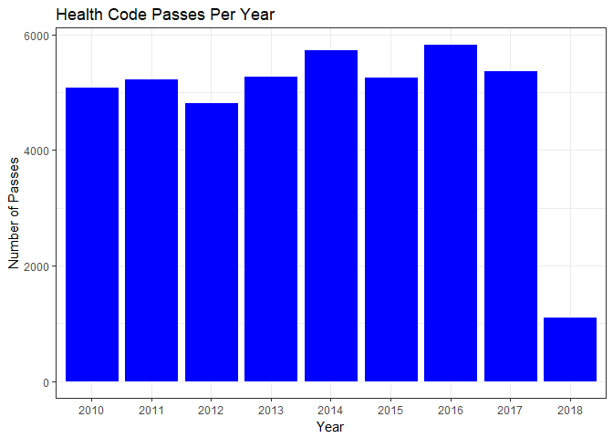
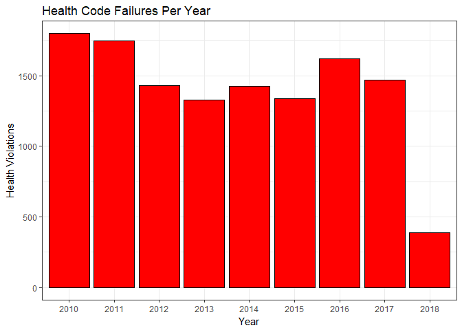
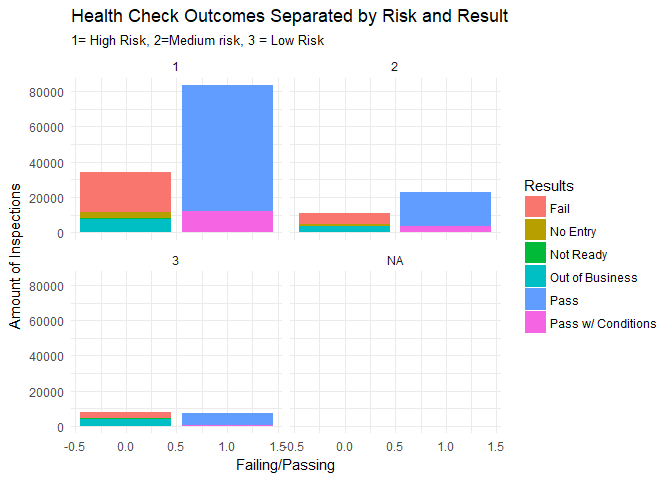

Problem Set 1: Health Inspector Data
================
Dan Gamarnik
April 16, 2018"

    ## # A tibble: 51,344 x 15
    ##    `Inspection ID`                           `DBA Name` `License #`
    ##              <int>                                <chr>       <int>
    ##  1         2159838                                 IHOP       50037
    ##  2         2159999                        THE BLANCHARD     2373807
    ##  3         2159995     WENDY'S OLD FASHIONED HAMBURGERS     2314101
    ##  4         2159984                     SIMON TACOS INC.     2496221
    ##  5         2159980            BROWNSTONE TAVERN & GRILL       39851
    ##  6         2159926               STEINGOLD'S OF CHICAGO     2543071
    ##  7         2159779                      MARISCOS ALMADA     2483049
    ##  8         2159977              RESTAURANT EL ASADOR II     2179622
    ##  9         2159876 MONTESSORI ACADEMY OF CHICAGO I, LLC     2215936
    ## 10         2159874 MONTESSORI ACADEMY OF CHICAGO I, LLC     2215935
    ## # ... with 51,334 more rows, and 12 more variables: `Facility Type` <chr>,
    ## #   Risk <chr>, Zip <int>, `Inspection Date` <chr>, `Inspection
    ## #   Type` <chr>, Results <chr>, Violations <chr>, Year <chr>, Pass <dbl>,
    ## #   Fail <dbl>, ResultsCoded <dbl>, Risknumb <dbl>

### 1: Location

The City of Chicago Food Inspections Data can be accessed at [this link](https://data.cityofchicago.org/Health-Human-Services/Food-Inspections/4ijn-s7e5/data). The data is stored through the Chicago Data Portal database. There are multiple features which allow the data to be manipulated and vizualized in the window, but it can also be exported in multiple formats. The data set is owned by the Chicago Department of Public Health.

### 2: Key Papers

The data describes the chatacteristics and results of health inspections in the city of Chicago and is curated and stored by the Chicago government (no authors are listed). It can be [accessed publicly](https://data.cityofchicago.org/Health-%20Human-Services/Food-Inspections/4ijn-s7e5/data) and downloaded with the "Export" module. It has been cited by numerous authors including Ho ([2012](http://www.jstor.org/stable/23528234)) and Harris et al. ([2014](https://www.cdc.gov/mmwr/preview/mmwrhtml/mm6332a1.htm)).

### 3: Collection

This information is derived from inspections of restaurants and other food establishments in Chicago from January 1, 2010 to the present. Inspections are performed by staff from the Chicago Department of Public Health's Food Protection Program using a standardized procedure. "The results of the inspection are inputted into a database, then reviewed and approved by a State of Illinois Licensed Environmental Health Practitioner (LEHP)"

### 4: Descriptive/Summary Statistics

*Table 1: Summary Statistics*

<table class="table table-striped" style="width: auto !important; ">
<thead>
<tr>
<th style="text-align:left;">
</th>
<th style="text-align:right;">
Inspection ID
</th>
<th style="text-align:left;">
DBA Name
</th>
<th style="text-align:right;">
License \#
</th>
<th style="text-align:left;">
Facility Type
</th>
<th style="text-align:left;">
Risk
</th>
<th style="text-align:right;">
Zip
</th>
<th style="text-align:left;">
Inspection Date
</th>
<th style="text-align:left;">
Inspection Type
</th>
<th style="text-align:left;">
Results
</th>
<th style="text-align:left;">
Violations
</th>
<th style="text-align:left;">
Year
</th>
<th style="text-align:right;">
Pass
</th>
<th style="text-align:right;">
Fail
</th>
<th style="text-align:right;">
ResultsCoded
</th>
<th style="text-align:right;">
Risknumb
</th>
</tr>
</thead>
<tbody>
<tr>
<td style="text-align:left;">
nbr.val
</td>
<td style="text-align:right;">
167412.00
</td>
<td style="text-align:left;">
NA
</td>
<td style="text-align:right;">
167397.00
</td>
<td style="text-align:left;">
NA
</td>
<td style="text-align:left;">
NA
</td>
<td style="text-align:right;">
167340.00
</td>
<td style="text-align:left;">
NA
</td>
<td style="text-align:left;">
NA
</td>
<td style="text-align:left;">
NA
</td>
<td style="text-align:left;">
NA
</td>
<td style="text-align:left;">
NA
</td>
<td style="text-align:right;">
167351.00
</td>
<td style="text-align:right;">
167351.00
</td>
<td style="text-align:right;">
167351.00
</td>
<td style="text-align:right;">
167324.00
</td>
</tr>
<tr>
<td style="text-align:left;">
nbr.null
</td>
<td style="text-align:right;">
0.00
</td>
<td style="text-align:left;">
NA
</td>
<td style="text-align:right;">
456.00
</td>
<td style="text-align:left;">
NA
</td>
<td style="text-align:left;">
NA
</td>
<td style="text-align:right;">
0.00
</td>
<td style="text-align:left;">
NA
</td>
<td style="text-align:left;">
NA
</td>
<td style="text-align:left;">
NA
</td>
<td style="text-align:left;">
NA
</td>
<td style="text-align:left;">
NA
</td>
<td style="text-align:right;">
53415.00
</td>
<td style="text-align:right;">
134910.00
</td>
<td style="text-align:right;">
0.00
</td>
<td style="text-align:right;">
0.00
</td>
</tr>
<tr>
<td style="text-align:left;">
nbr.na
</td>
<td style="text-align:right;">
0.00
</td>
<td style="text-align:left;">
NA
</td>
<td style="text-align:right;">
15.00
</td>
<td style="text-align:left;">
NA
</td>
<td style="text-align:left;">
NA
</td>
<td style="text-align:right;">
72.00
</td>
<td style="text-align:left;">
NA
</td>
<td style="text-align:left;">
NA
</td>
<td style="text-align:left;">
NA
</td>
<td style="text-align:left;">
NA
</td>
<td style="text-align:left;">
NA
</td>
<td style="text-align:right;">
61.00
</td>
<td style="text-align:right;">
61.00
</td>
<td style="text-align:right;">
61.00
</td>
<td style="text-align:right;">
88.00
</td>
</tr>
<tr>
<td style="text-align:left;">
min
</td>
<td style="text-align:right;">
44247.00
</td>
<td style="text-align:left;">
NA
</td>
<td style="text-align:right;">
0.00
</td>
<td style="text-align:left;">
NA
</td>
<td style="text-align:left;">
NA
</td>
<td style="text-align:right;">
60007.00
</td>
<td style="text-align:left;">
NA
</td>
<td style="text-align:left;">
NA
</td>
<td style="text-align:left;">
NA
</td>
<td style="text-align:left;">
NA
</td>
<td style="text-align:left;">
NA
</td>
<td style="text-align:right;">
0.00
</td>
<td style="text-align:right;">
0.00
</td>
<td style="text-align:right;">
1.00
</td>
<td style="text-align:right;">
1.00
</td>
</tr>
<tr>
<td style="text-align:left;">
max
</td>
<td style="text-align:right;">
2160035.00
</td>
<td style="text-align:left;">
NA
</td>
<td style="text-align:right;">
9999999.00
</td>
<td style="text-align:left;">
NA
</td>
<td style="text-align:left;">
NA
</td>
<td style="text-align:right;">
60827.00
</td>
<td style="text-align:left;">
NA
</td>
<td style="text-align:left;">
NA
</td>
<td style="text-align:left;">
NA
</td>
<td style="text-align:left;">
NA
</td>
<td style="text-align:left;">
NA
</td>
<td style="text-align:right;">
1.00
</td>
<td style="text-align:right;">
1.00
</td>
<td style="text-align:right;">
6.00
</td>
<td style="text-align:right;">
3.00
</td>
</tr>
<tr>
<td style="text-align:left;">
range
</td>
<td style="text-align:right;">
2115788.00
</td>
<td style="text-align:left;">
NA
</td>
<td style="text-align:right;">
9999999.00
</td>
<td style="text-align:left;">
NA
</td>
<td style="text-align:left;">
NA
</td>
<td style="text-align:right;">
820.00
</td>
<td style="text-align:left;">
NA
</td>
<td style="text-align:left;">
NA
</td>
<td style="text-align:left;">
NA
</td>
<td style="text-align:left;">
NA
</td>
<td style="text-align:left;">
NA
</td>
<td style="text-align:right;">
1.00
</td>
<td style="text-align:right;">
1.00
</td>
<td style="text-align:right;">
5.00
</td>
<td style="text-align:right;">
2.00
</td>
</tr>
<tr>
<td style="text-align:left;">
sum
</td>
<td style="text-align:right;">
NA
</td>
<td style="text-align:left;">
NA
</td>
<td style="text-align:right;">
NA
</td>
<td style="text-align:left;">
NA
</td>
<td style="text-align:left;">
NA
</td>
<td style="text-align:right;">
NA
</td>
<td style="text-align:left;">
NA
</td>
<td style="text-align:left;">
NA
</td>
<td style="text-align:left;">
NA
</td>
<td style="text-align:left;">
NA
</td>
<td style="text-align:left;">
NA
</td>
<td style="text-align:right;">
113936.00
</td>
<td style="text-align:right;">
32441.00
</td>
<td style="text-align:right;">
404492.00
</td>
<td style="text-align:right;">
232661.00
</td>
</tr>
<tr>
<td style="text-align:left;">
median
</td>
<td style="text-align:right;">
1396098.50
</td>
<td style="text-align:left;">
NA
</td>
<td style="text-align:right;">
1937764.00
</td>
<td style="text-align:left;">
NA
</td>
<td style="text-align:left;">
NA
</td>
<td style="text-align:right;">
60625.00
</td>
<td style="text-align:left;">
NA
</td>
<td style="text-align:left;">
NA
</td>
<td style="text-align:left;">
NA
</td>
<td style="text-align:left;">
NA
</td>
<td style="text-align:left;">
NA
</td>
<td style="text-align:right;">
1.00
</td>
<td style="text-align:right;">
0.00
</td>
<td style="text-align:right;">
1.00
</td>
<td style="text-align:right;">
1.00
</td>
</tr>
<tr>
<td style="text-align:left;">
mean
</td>
<td style="text-align:right;">
1308723.70
</td>
<td style="text-align:left;">
NA
</td>
<td style="text-align:right;">
1543088.76
</td>
<td style="text-align:left;">
NA
</td>
<td style="text-align:left;">
NA
</td>
<td style="text-align:right;">
60629.06
</td>
<td style="text-align:left;">
NA
</td>
<td style="text-align:left;">
NA
</td>
<td style="text-align:left;">
NA
</td>
<td style="text-align:left;">
NA
</td>
<td style="text-align:left;">
NA
</td>
<td style="text-align:right;">
0.68
</td>
<td style="text-align:right;">
0.19
</td>
<td style="text-align:right;">
2.42
</td>
<td style="text-align:right;">
1.39
</td>
</tr>
<tr>
<td style="text-align:left;">
SE.mean
</td>
<td style="text-align:right;">
1429.22
</td>
<td style="text-align:left;">
NA
</td>
<td style="text-align:right;">
2160.67
</td>
<td style="text-align:left;">
NA
</td>
<td style="text-align:left;">
NA
</td>
<td style="text-align:right;">
0.06
</td>
<td style="text-align:left;">
NA
</td>
<td style="text-align:left;">
NA
</td>
<td style="text-align:left;">
NA
</td>
<td style="text-align:left;">
NA
</td>
<td style="text-align:left;">
NA
</td>
<td style="text-align:right;">
0.00
</td>
<td style="text-align:right;">
0.00
</td>
<td style="text-align:right;">
0.00
</td>
<td style="text-align:right;">
0.00
</td>
</tr>
<tr>
<td style="text-align:left;">
CI.mean.0.95
</td>
<td style="text-align:right;">
2801.24
</td>
<td style="text-align:left;">
NA
</td>
<td style="text-align:right;">
4234.86
</td>
<td style="text-align:left;">
NA
</td>
<td style="text-align:left;">
NA
</td>
<td style="text-align:right;">
0.11
</td>
<td style="text-align:left;">
NA
</td>
<td style="text-align:left;">
NA
</td>
<td style="text-align:left;">
NA
</td>
<td style="text-align:left;">
NA
</td>
<td style="text-align:left;">
NA
</td>
<td style="text-align:right;">
0.00
</td>
<td style="text-align:right;">
0.00
</td>
<td style="text-align:right;">
0.01
</td>
<td style="text-align:right;">
0.00
</td>
</tr>
<tr>
<td style="text-align:left;">
var
</td>
<td style="text-align:right;">
341967185271.26
</td>
<td style="text-align:left;">
NA
</td>
<td style="text-align:right;">
781490954625.24
</td>
<td style="text-align:left;">
NA
</td>
<td style="text-align:left;">
NA
</td>
<td style="text-align:right;">
506.41
</td>
<td style="text-align:left;">
NA
</td>
<td style="text-align:left;">
NA
</td>
<td style="text-align:left;">
NA
</td>
<td style="text-align:left;">
NA
</td>
<td style="text-align:left;">
NA
</td>
<td style="text-align:right;">
0.22
</td>
<td style="text-align:right;">
0.16
</td>
<td style="text-align:right;">
3.96
</td>
<td style="text-align:right;">
0.42
</td>
</tr>
<tr>
<td style="text-align:left;">
std.dev
</td>
<td style="text-align:right;">
584779.60
</td>
<td style="text-align:left;">
NA
</td>
<td style="text-align:right;">
884019.77
</td>
<td style="text-align:left;">
NA
</td>
<td style="text-align:left;">
NA
</td>
<td style="text-align:right;">
22.50
</td>
<td style="text-align:left;">
NA
</td>
<td style="text-align:left;">
NA
</td>
<td style="text-align:left;">
NA
</td>
<td style="text-align:left;">
NA
</td>
<td style="text-align:left;">
NA
</td>
<td style="text-align:right;">
0.47
</td>
<td style="text-align:right;">
0.40
</td>
<td style="text-align:right;">
1.99
</td>
<td style="text-align:right;">
0.65
</td>
</tr>
<tr>
<td style="text-align:left;">
coef.var
</td>
<td style="text-align:right;">
0.45
</td>
<td style="text-align:left;">
NA
</td>
<td style="text-align:right;">
0.57
</td>
<td style="text-align:left;">
NA
</td>
<td style="text-align:left;">
NA
</td>
<td style="text-align:right;">
0.00
</td>
<td style="text-align:left;">
NA
</td>
<td style="text-align:left;">
NA
</td>
<td style="text-align:left;">
NA
</td>
<td style="text-align:left;">
NA
</td>
<td style="text-align:left;">
NA
</td>
<td style="text-align:right;">
0.68
</td>
<td style="text-align:right;">
2.04
</td>
<td style="text-align:right;">
0.82
</td>
<td style="text-align:right;">
0.47
</td>
</tr>
</tbody>
</table>
Table 1 shows a summary of 14 different variables, including the original catagorical characters and numerical codings of them.

### 5. Vizualization

*Figure 1: Health Passes*

*Figure 2: Health Violations*

 The number of food inspection violations seems to have decreased since 2011 but has been increasing in recent years as seen in Figure 1. Interestingly, those places with the lowest risks had the highest number of health code violations, possibly owing to their lower risk to the community should something go wrong. This figure looks at the outcomes of inspections and is conditional based on the more specific results (for passing) and is faceted based on the risk level. Likewise, the highest risk catagory was the most likely to get a "Not Ready" designation instead of a pass.

### 6. Conditional Summary

*Figure 3: Health Outcomes Conditional on Risk and Result*

This is a conditional analysis looking at different types of passing conditional on health risk.
