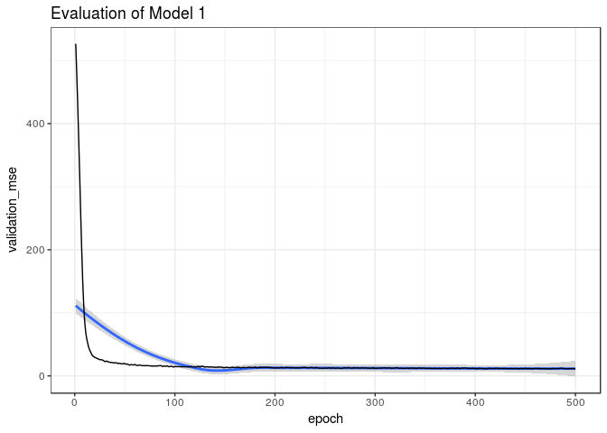
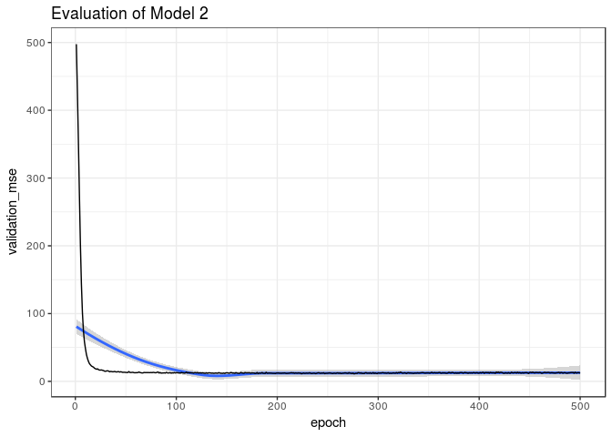
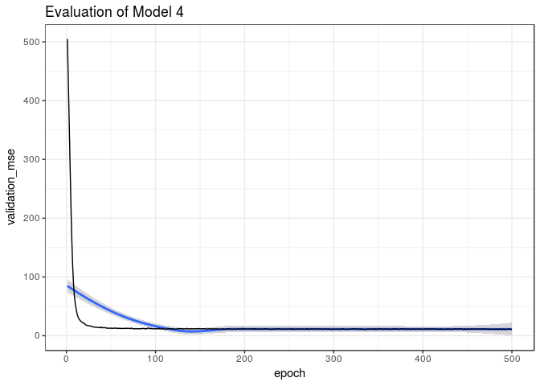
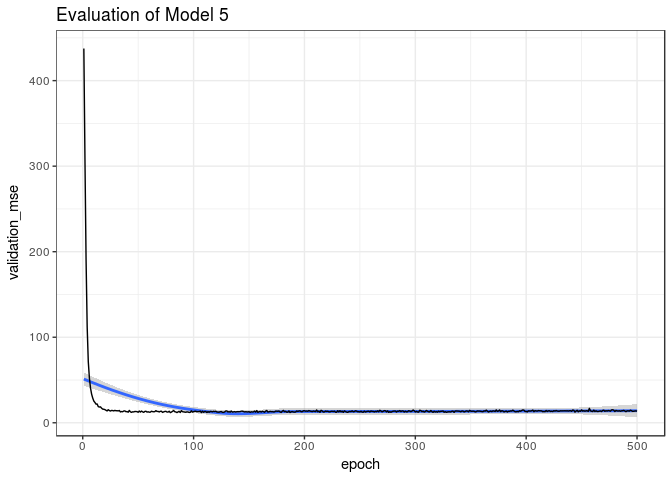
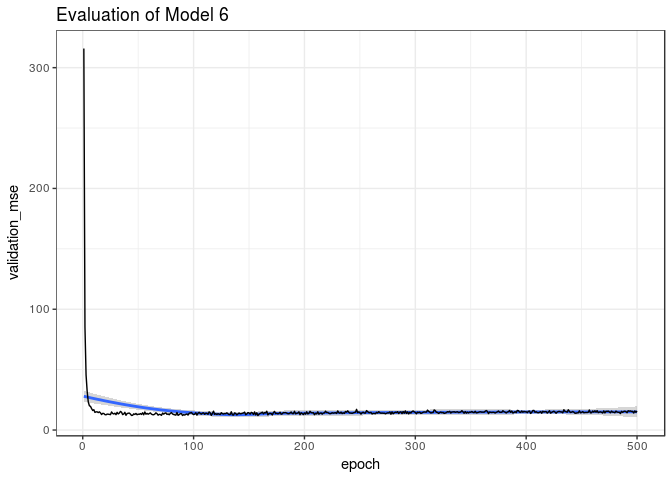
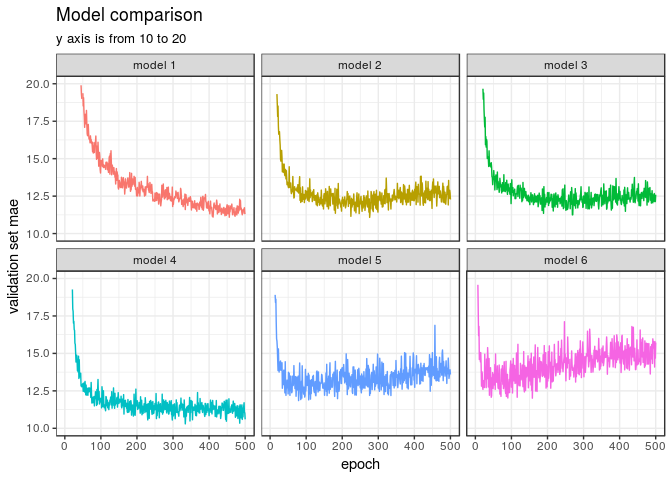

PS3 Part 2
================
Dan Gamarnik
May 16, 2018

``` r
library(keras)
# install_keras(tensorflow = "gpu")
library(modelr)
library(tidyverse)
```

    ## ── Attaching packages ───────────────────────────────────────────────── tidyverse 1.2.1 ──

    ## ✔ ggplot2 2.2.1     ✔ purrr   0.2.4
    ## ✔ tibble  1.4.2     ✔ dplyr   0.7.4
    ## ✔ tidyr   0.7.2     ✔ stringr 1.2.0
    ## ✔ readr   1.1.1     ✔ forcats 0.2.0

    ## ── Conflicts ──────────────────────────────────────────────────── tidyverse_conflicts() ──
    ## ✖ dplyr::filter() masks stats::filter()
    ## ✖ dplyr::lag()    masks stats::lag()

``` r
library(knitr)
```

``` r
dataset <- dataset_boston_housing()
c(c(train_data, train_targets), c(test_data, test_targets)) %<-% dataset

mean <- apply(train_data, 2, mean)
std <- apply(train_data, 2, sd)
train_data <- scale(train_data, center = mean, scale = std)
test_data <- scale(test_data, center = mean, scale = std)
```

#### Model 1

Using 6 different models:

``` r
set.seed(1234)

build_model1 <- function() {
  model <- keras_model_sequential() %>%
    layer_dense(units = 64, activation = "relu",
                input_shape = dim(train_data)[[2]]) %>%
    layer_dropout(rate = 0.5) %>%
    layer_dense(units = 64, activation = "relu") %>%
    layer_dropout(rate = 0.5) %>%
    layer_dense(units = 1)
  model %>% compile(
    optimizer = "rmsprop",
    loss = "mse",
    metrics = c("mse")
  )
}


k <- 10
indices <- sample(1:nrow(train_data))
folds <- cut(indices, breaks = k, labels = FALSE)
num_epochs <- 500
all_mse_histories <- NULL
all_loss_histories <- NULL
for (i in 1:k) {
  cat("processing fold #", i, "\n")
  val_indices <- which(folds == i, arr.ind = TRUE)
  val_data <- train_data[val_indices,]
  val_targets <- train_targets[val_indices]
  partial_train_data <- train_data[-val_indices,]
  partial_train_targets <- train_targets[-val_indices]
  model <- build_model1()
  history <- model %>% fit(
    partial_train_data, partial_train_targets,
    validation_data = list(val_data, val_targets),
    epochs = num_epochs, batch_size = 40, verbose = 0
    )
  mse_history <- history$metrics$val_mean_squared_error
  all_mse_histories <- rbind(all_mse_histories, mse_history)
  loss_history <- history$metrics$val_loss
  all_loss_histories <- rbind(all_loss_histories, loss_history)
}
```

    ## processing fold # 1 
    ## processing fold # 2 
    ## processing fold # 3 
    ## processing fold # 4 
    ## processing fold # 5 
    ## processing fold # 6 
    ## processing fold # 7 
    ## processing fold # 8 
    ## processing fold # 9 
    ## processing fold # 10

``` r
average_loss_history <- data.frame(
  epoch = seq(1:ncol(all_loss_histories)),
  validation_loss = apply(all_loss_histories, 2, mean)
)

average_mse_history <- data.frame(
  epoch = seq(1:ncol(all_mse_histories)),
  validation_mse = apply(all_mse_histories, 2, mean)
)
```

``` r
ggplot(average_mse_history, aes(x = epoch, y = validation_mse)) + 
  geom_smooth() + geom_line() +
  theme_bw() +
  labs(title = "Evaluation of Model 1")
```

    ## `geom_smooth()` using method = 'loess'



#### Model 2

``` r
set.seed(1234)

build_model2 <- function() {
  model <- keras_model_sequential() %>%
    layer_dense(units = 64, activation = "relu",
                kernel_regularizer = regularizer_l1(0.001),
                input_shape = dim(train_data)[[2]]) %>%
    layer_dense(units = 64, activation = "relu",
                kernel_regularizer = regularizer_l1(0.001)) %>%
    layer_dense(units = 1)
  model %>% compile(
    optimizer = "rmsprop",
    loss = "mse",
    metrics = c("mse")
  )
}


indices <- sample(1:nrow(train_data))
folds <- cut(indices, breaks = k, labels = FALSE)
all_mse_histories1 <- NULL
all_loss_histories1 <- NULL
for (i in 1:k) {
  cat("processing fold #", i, "\n")
  val_indices <- which(folds == i, arr.ind = TRUE)
  val_data <- train_data[val_indices,]
  val_targets <- train_targets[val_indices]
  partial_train_data <- train_data[-val_indices,]
  partial_train_targets <- train_targets[-val_indices]
  model <- build_model2()
  history <- model %>% fit(
    partial_train_data, partial_train_targets,
    validation_data = list(val_data, val_targets),
    epochs = num_epochs, batch_size = 40, verbose = 0
    )
  mse_history <- history$metrics$val_mean_squared_error
  all_mse_histories1 <- rbind(all_mse_histories1, mse_history)
  loss_history <- history$metrics$val_loss
  all_loss_histories1 <- rbind(all_loss_histories1, loss_history)
}
```

    ## processing fold # 1 
    ## processing fold # 2 
    ## processing fold # 3 
    ## processing fold # 4 
    ## processing fold # 5 
    ## processing fold # 6 
    ## processing fold # 7 
    ## processing fold # 8 
    ## processing fold # 9 
    ## processing fold # 10

``` r
average_loss_history1 <- data.frame(
  epoch = seq(1:ncol(all_loss_histories1)),
  validation_loss = apply(all_loss_histories1, 2, mean)
)

average_mse_history1 <- data.frame(
  epoch = seq(1:ncol(all_mse_histories1)),
  validation_mse = apply(all_mse_histories1, 2, mean)
)
```

``` r
ggplot(average_mse_history1, aes(x = epoch, y = validation_mse)) + 
  geom_smooth() + geom_line() +
  theme_bw() +
  labs(title = "Evaluation of Model 2")
```

    ## `geom_smooth()` using method = 'loess'



#### Model 3

``` r
set.seed(1234)

build_model3 <- function() {
  model <- keras_model_sequential() %>%
    layer_dense(units = 64, activation = "relu",
                kernel_regularizer = regularizer_l2(0.001),
                input_shape = dim(train_data)[[2]]) %>%
    layer_dense(units = 64, activation = "relu",
                kernel_regularizer = regularizer_l2(0.001)) %>%
    layer_dense(units = 1)
  model %>% compile(
    optimizer = "rmsprop",
    loss = "mse",
    metrics = c("mse")
  )
}


indices <- sample(1:nrow(train_data))
folds <- cut(indices, breaks = k, labels = FALSE)
all_mse_histories2 <- NULL
all_loss_histories2 <- NULL
for (i in 1:k) {
  cat("processing fold #", i, "\n")
  val_indices <- which(folds == i, arr.ind = TRUE)
  val_data <- train_data[val_indices,]
  val_targets <- train_targets[val_indices]
  partial_train_data <- train_data[-val_indices,]
  partial_train_targets <- train_targets[-val_indices]
  model <- build_model3()
  history <- model %>% fit(
    partial_train_data, partial_train_targets,
    validation_data = list(val_data, val_targets),
    epochs = num_epochs, batch_size = 40, verbose = 0
    )
  mse_history <- history$metrics$val_mean_squared_error
  all_mse_histories2 <- rbind(all_mse_histories2, mse_history)
  loss_history <- history$metrics$val_loss
  all_loss_histories2 <- rbind(all_loss_histories2, loss_history)
}
```

    ## processing fold # 1 
    ## processing fold # 2 
    ## processing fold # 3 
    ## processing fold # 4 
    ## processing fold # 5 
    ## processing fold # 6 
    ## processing fold # 7 
    ## processing fold # 8 
    ## processing fold # 9 
    ## processing fold # 10

``` r
average_loss_history2 <- data.frame(
  epoch = seq(1:ncol(all_loss_histories2)),
  validation_loss = apply(all_loss_histories2, 2, mean)
)

average_mse_history2 <- data.frame(
  epoch = seq(1:ncol(all_mse_histories2)),
  validation_mse = apply(all_mse_histories2, 2, mean)
)
```

``` r
ggplot(average_mse_history2, aes(x = epoch, y = validation_mse)) + 
  geom_smooth() + geom_line() +
  theme_bw() +
  labs(title = "Evaluation of Model 3")
```

    ## `geom_smooth()` using method = 'loess'


#### Model 4

``` r
set.seed(1234)

build_model4 <- function() {
  model <- keras_model_sequential() %>%
    layer_dense(units = 64, activation = "relu",
                kernel_regularizer = regularizer_l1_l2(0.001),
                input_shape = dim(train_data)[[2]]) %>%
    layer_dense(units = 64, activation = "relu",
                kernel_regularizer = regularizer_l1_l2(0.001)) %>%
    layer_dense(units = 1)
  model %>% compile(
    optimizer = "rmsprop",
    loss = "mse",
    metrics = c("mse")
  )
}

indices <- sample(1:nrow(train_data))
folds <- cut(indices, breaks = k, labels = FALSE)
all_mse_histories3 <- NULL
all_loss_histories3 <- NULL
for (i in 1:k) {
  cat("processing fold #", i, "\n")
  val_indices <- which(folds == i, arr.ind = TRUE)
  val_data <- train_data[val_indices,]
  val_targets <- train_targets[val_indices]
  partial_train_data <- train_data[-val_indices,]
  partial_train_targets <- train_targets[-val_indices]
  model <- build_model4()
  history <- model %>% fit(
    partial_train_data, partial_train_targets,
    validation_data = list(val_data, val_targets),
    epochs = num_epochs, batch_size = 40, verbose = 0
    )
  mse_history <- history$metrics$val_mean_squared_error
  all_mse_histories3 <- rbind(all_mse_histories3, mse_history)
  loss_history <- history$metrics$val_loss
  all_loss_histories3 <- rbind(all_loss_histories3, loss_history)
}
```

    ## processing fold # 1 
    ## processing fold # 2 
    ## processing fold # 3 
    ## processing fold # 4 
    ## processing fold # 5 
    ## processing fold # 6 
    ## processing fold # 7 
    ## processing fold # 8 
    ## processing fold # 9 
    ## processing fold # 10

``` r
average_loss_history3 <- data.frame(
  epoch = seq(1:ncol(all_loss_histories3)),
  validation_loss = apply(all_loss_histories3, 2, mean)
)

average_mse_history3 <- data.frame(
  epoch = seq(1:ncol(all_mse_histories3)),
  validation_mse = apply(all_mse_histories3, 2, mean)
)
```

``` r
ggplot(average_mse_history3, aes(x = epoch, y = validation_mse)) + 
  geom_smooth() + geom_line() +
  theme_bw() +
  labs(title = "Evaluation of Model 4")
```

    ## `geom_smooth()` using method = 'loess'



#### Model 5

``` r
set.seed(1234)

build_model5 <- function() {
  model <- keras_model_sequential() %>%
    layer_dense(units = 110, activation = "relu",
                kernel_regularizer = regularizer_l2(0.001),
                input_shape = dim(train_data)[[2]]) %>%
    layer_dense(units = 110, activation = "relu",
                kernel_regularizer = regularizer_l2(0.001)) %>%
    layer_dense(units = 1)
  model %>% compile(
    optimizer = "rmsprop",
    loss = "mse",
    metrics = c("mse")
  )
}


indices <- sample(1:nrow(train_data))
folds <- cut(indices, breaks = k, labels = FALSE)
all_mse_histories4 <- NULL
all_loss_histories4 <- NULL
for (i in 1:k) {
  cat("processing fold #", i, "\n")
  val_indices <- which(folds == i, arr.ind = TRUE)
  val_data <- train_data[val_indices,]
  val_targets <- train_targets[val_indices]
  partial_train_data <- train_data[-val_indices,]
  partial_train_targets <- train_targets[-val_indices]
  model <- build_model5()
  history <- model %>% fit(
    partial_train_data, partial_train_targets,
    validation_data = list(val_data, val_targets),
    epochs = num_epochs, batch_size = 40, verbose = 0
    )
  mse_history <- history$metrics$val_mean_squared_error
  all_mse_histories4 <- rbind(all_mse_histories4, mse_history)
  loss_history <- history$metrics$val_loss
  all_loss_histories4 <- rbind(all_loss_histories4, loss_history)
}
```

    ## processing fold # 1 
    ## processing fold # 2 
    ## processing fold # 3 
    ## processing fold # 4 
    ## processing fold # 5 
    ## processing fold # 6 
    ## processing fold # 7 
    ## processing fold # 8 
    ## processing fold # 9 
    ## processing fold # 10

``` r
average_loss_history4 <- data.frame(
  epoch = seq(1:ncol(all_loss_histories4)),
  validation_loss = apply(all_loss_histories4, 2, mean)
)

average_mse_history4 <- data.frame(
  epoch = seq(1:ncol(all_mse_histories4)),
  validation_mse = apply(all_mse_histories4, 2, mean)
)
```

``` r
ggplot(average_mse_history4, aes(x = epoch, y = validation_mse)) + 
  geom_smooth() +
  geom_line() +
  theme_bw() +
  labs(title = "Evaluation of Model 5")
```

    ## `geom_smooth()` using method = 'loess'



#### Model 6

``` r
set.seed(1234)

build_model6 <- function() {
  model <- keras_model_sequential() %>%
    layer_dense(units = 64, activation = "relu",
                kernel_regularizer = regularizer_l2(0.001),
                input_shape = dim(train_data)[[2]]) %>%
    layer_dense(units = 64, activation = "relu",
                kernel_regularizer = regularizer_l2(0.001)) %>%
    layer_dense(units = 64, activation = "relu",
                kernel_regularizer = regularizer_l2(0.001)) %>%
    layer_dense(units = 1)
  model %>% compile(
    optimizer = "rmsprop",
    loss = "mse",
    metrics = c("mse")
  )
}


indices <- sample(1:nrow(train_data))
folds <- cut(indices, breaks = k, labels = FALSE)
all_mse_histories5 <- NULL
all_loss_histories5 <- NULL
for (i in 1:k) {
  cat("processing fold #", i, "\n")
  val_indices <- which(folds == i, arr.ind = TRUE)
  val_data <- train_data[val_indices,]
  val_targets <- train_targets[val_indices]
  partial_train_data <- train_data[-val_indices,]
  partial_train_targets <- train_targets[-val_indices]
  model <- build_model6()
  history <- model %>% fit(
    partial_train_data, partial_train_targets,
    validation_data = list(val_data, val_targets),
    epochs = num_epochs, batch_size = 20, verbose = 0
    )
  mse_history <- history$metrics$val_mean_squared_error
  all_mse_histories5 <- rbind(all_mse_histories5, mse_history)
  loss_history <- history$metrics$val_loss
  all_loss_histories5 <- rbind(all_loss_histories5, loss_history)
}
```

    ## processing fold # 1 
    ## processing fold # 2 
    ## processing fold # 3 
    ## processing fold # 4 
    ## processing fold # 5 
    ## processing fold # 6 
    ## processing fold # 7 
    ## processing fold # 8 
    ## processing fold # 9 
    ## processing fold # 10

``` r
average_loss_history5 <- data.frame(
  epoch = seq(1:ncol(all_loss_histories5)),
  validation_loss = apply(all_loss_histories5, 2, mean)
)

average_mse_history5 <- data.frame(
  epoch = seq(1:ncol(all_mse_histories5)),
  validation_mse = apply(all_mse_histories5, 2, mean)
)
```

``` r
ggplot(average_mse_history5, aes(x = epoch, y = validation_mse)) + 
  geom_smooth() +
  geom_line() +
  theme_bw() +
  labs(title = "Evaluation of Model 6")
```

    ## `geom_smooth()` using method = 'loess'



#### Model selection

``` r
model_selection <- bind_rows("model 1" = average_mse_history,
          "model 2" = average_mse_history1,
          "model 3" = average_mse_history2,
          "model 4" = average_mse_history3,
          "model 5" = average_mse_history4,
          "model 6" = average_mse_history5,
          .id = "model")
model_selection %>%
  ggplot(aes(epoch, validation_mse, color = model)) +
  geom_line(show.legend = FALSE) +
  theme_bw() +
  labs(title = "Model comparison",
       subtitle = "y axis is from 10 to 20",
       y = "validation set mae") +
  facet_wrap(~ model) +
  ylim(10, 20)
```

    ## Warning: Removed 119 rows containing missing values (geom_path).



``` r
model_selection %>%
  ggplot(aes(epoch, validation_mse, color = model)) +
  geom_smooth() +
  theme_bw() +
  labs(title = "Model comparison in detail",
       subtitle = "by smooth line",
       y = "validation set mae") +
  ylim(10, 20)
```

    ## `geom_smooth()` using method = 'loess'

    ## Warning: Removed 121 rows containing non-finite values (stat_smooth).


According to two graphs, model 3 has stable low MSEs and model 6 has the lowest MSEs in some epochs.

#### Final model

``` r
set.seed(1234)
model <- build_model3()
model %>% fit(train_data, train_targets,
              epochs = 175, batch_size = 20, verbose = 0)
result <- model %>% evaluate(test_data, test_targets)
```

``` r
# results:

    ## $loss
    ## [1] 11.89607
    ## 
    ## $mean_squared_error
    ## [1] 11.73591
```

According to the two graphs, I choose the third model at the epoch of 175 for the final model. Although the sixth model can have lower MSEs in some epochs, the variance is relatively high. When we look at the smoother lines, the third model is more stable for prediction. In the final model, the test MSE (11.73591) and the test loss (11.89607) are considerably low. However, it is worth noting that the MSE in the model wll keep changing in an interval if we run the model again and again. We thus might get a lower or higher MSE in the next time when we run the model again. This means the specific value of the MSE can be manipulated and what we should consider is the interval rather than the specific number.
